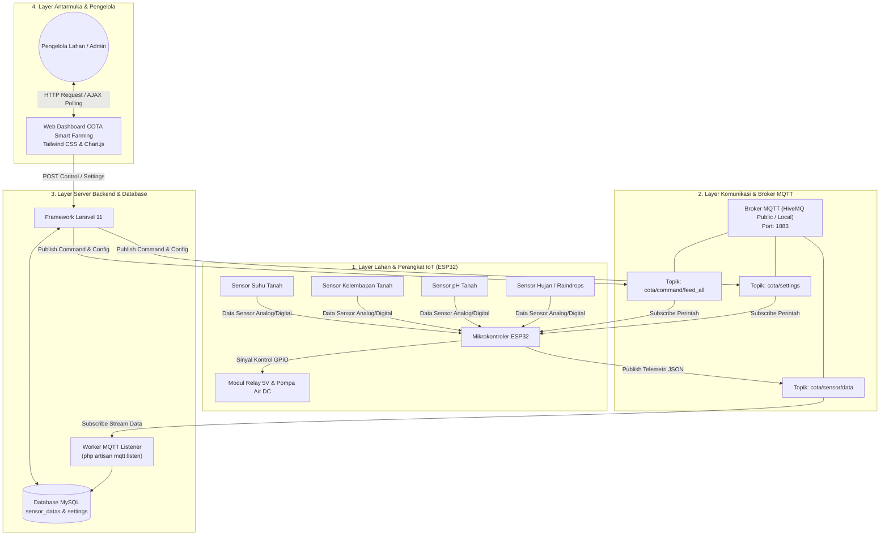
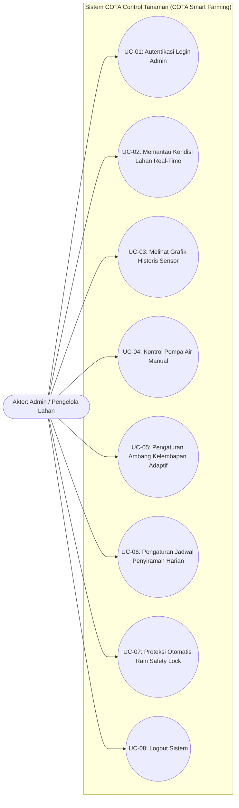
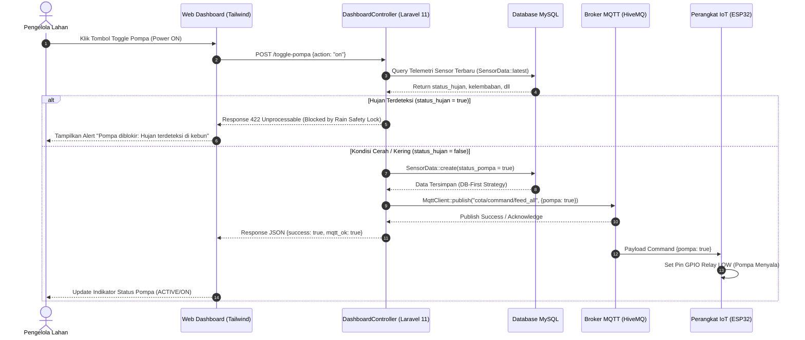
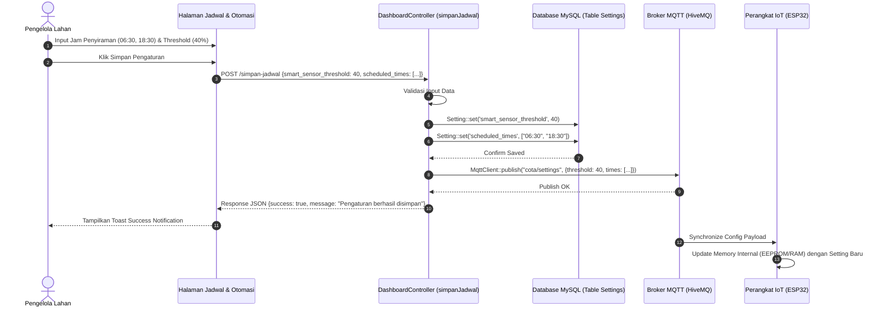
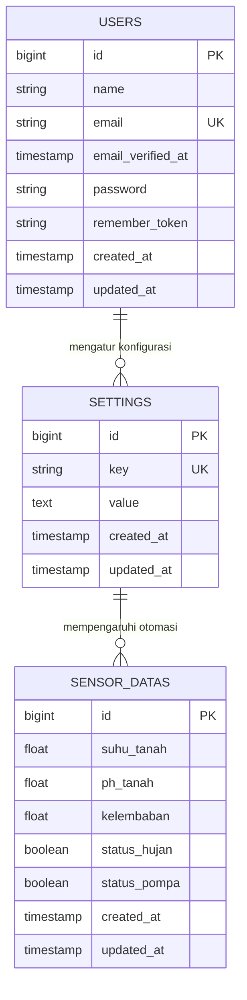

# 📑 NASKAH REVISI TOTAL LAPORAN KERJA PRAKTIK
**Judul Laporan**: IMPLEMENTASI INTERNET OF THINGS (IOT) PADA SISTEM MONITORING TANAMAN, SUHU, KELEMBABAN, DAN PH TANAH SERTA KONTROL POMPA AIR BERBASIS WEB PADA PERUSAHAAN DOKTORTJ DIGITAL INSTITUTE  
**Nama**: Arvan Murbiyanto  
**NIM**: 2311102074  
**Program Studi**: S1 Teknik Informatika - Universitas Telkom (2026)

---

## 3.4 Arsitektur Sistem

Arsitektur sistem pada **COTA Control Tanaman (COTA Smart Farming)** dirancang dengan pendekatan *multi-tier architecture* yang menghubungkan perangkat keras (*hardware IoT*) di lahan pertanian, *broker* komunikasi nirkabel berbasis MQTT, *server backend* berbasis framework Laravel 11, basis data relasional MySQL, serta antarmuka *dashboard web* berbasis Tailwind CSS.

Secara umum, sistem terdiri dari 4 (empat) lapisan utama:
1. **Layer Lahan & Perangkat IoT (Hardware Layer)**: Terdiri dari mikrokontroler ESP32 yang terhubung ke sensor suhu tanah, sensor kelembapan tanah, sensor pH tanah, dan sensor hujan (*raindrops module*), serta aktuator modul *relay 5V* pengendali pompa air DC.
2. **Layer Broker MQTT (Communication Layer)**: Menggunakan *broker* MQTT public/cloud (HiveMQ Broker / Local Mosquitto) dengan port 1883. Protokol MQTT digunakan karena sifatnya yang *lightweight*, berbasis *publish/subscribe*, dan sangat efisien untuk pengiriman data telemetri secara *real-time*.
3. **Layer Server Backend & Database (Application Layer)**: Menggunakan framework Laravel 11 dengan PHP 8.2+ untuk menangani logika bisnis, pengolahan data telemetri, *worker listener* MQTT (`php artisan mqtt:listen`), serta manajemen basis data MySQL (`sensor_datas` dan `settings`).
4. **Layer Antarmuka Pengguna (Presentation Layer)**: Antarmuka *dashboard web* interaktif dan responsif berbasis Tailwind CSS dan Chart.js yang diakses oleh pengelola lahan/admin melalui *web browser* desktop maupun mobile.

---

### 3.4.1 Diagram Use Case

Diagram *Use Case* menggambarkan interaksi fungsional antara aktor **Pengelola Lahan / Admin** dengan sistem **COTA Smart Farming**.

Admin memiliki hak akses penuh untuk melakukan autentikasi login, memantau kondisi parameter lingkungan secara *real-time*, melihat grafik tren sejarah sensor, mengendalikan pompa air secara manual, mengonfigurasi batas kelembapan tanah adaptif, mengatur jadwal jam penyiraman harian, serta memantau status pengaman cuaca (*Rain Safety Lock*).

---

### 3.4.2 Activity Diagram

Activity Diagram menggambarkan alur kerja (*workflow*) operasional sistem, baik dari sisi aktivitas pengguna (Admin) saat mengoperasikan antarmuka *dashboard web* maupun alur kerja otomatisasi sistem perangkat keras (*worker* & mikrokontroler ESP32).

1. **Activity Diagram Admin (Web Monitoring & Control)**: Alur dimulai dari proses autentikasi login admin. Jika kredensial valid, admin masuk ke dashboard untuk memantau data sensor *real-time*, membuka detail grafik historis, mengeksekusi kendali pompa manual (dengan pemeriksaan otomatis *Rain Safety Lock*), atau mengubah konfigurasi parameter otomatisasi irigasi.
2. **Activity Diagram Otomasi Irigasi (ESP32 & Worker)**: Alur proses latar belakang di mana mikrokontroler membaca parameter sensor secara berkala, mengirimkan data telemetri JSON via MQTT ke topik `cota/sensor/data`, diikuti oleh pengujian kondisi hujan. Jika hujan terdeteksi, *Rain Safety Lock* otomatis mengunci/mematikan pompa. Jika cerah, sistem mengevaluasi mode adaptif (*threshold*) atau mode penjadwalan harian (*scheduled*) untuk menyalakan modul relay pompa air.

---

### 3.4.3 Sequence Diagram

Sequence Diagram mendeskripsikan interaksi kronologis berbasis waktu antar komponen sistem (Pengelola Lahan, Dashboard Web, `DashboardController`, Database MySQL, Broker MQTT, dan Perangkat ESP32):

1. **Sequence Diagram Kontrol Pompa Manual & Rain Safety Lock**: Menggambarkan alur ketika Admin menekan tombol *Power Toggle* pompa. Sistem akan memeriksa kondisi presipitasi hujan terkini dari database (`status_hujan`). Jika hujan terdeteksi, perintah ditolak (fitur *Rain Safety Lock*). Jika cerah, sistem menerapkan strategi *DB-First* untuk menyimpan status pompa ke database, kemudian mempublikasikan perintah JSON `{ "pompa": true }` ke topik MQTT `cota/command/feed_all` yang langsung dieksekusi oleh relay ESP32.
2. **Sequence Diagram Pengaturan Jadwal & Threshold Adaptif**: Menggambarkan alur ketika Admin mengedit nilai batas kelembapan adaptif (misal: `< 40%`) dan jam penyiraman harian (misal: `06:30` & `18:30`). Perubahan divalidasi dan disimpan di tabel `settings`, kemudian dipublikasikan ke topik MQTT `cota/settings` agar mikrokontroler ESP32 menyinkronkan konfigurasi internalnya.
3. **Sequence Diagram Telemetri Sensor & Worker Listener**: Menggambarkan pengiriman data telemetri berkala dari sensor ESP32 ke broker MQTT. *Worker Listener* Laravel (`php artisan mqtt:listen`) yang berjalan di latar belakang akan menangkap *payload* JSON dan meng-insert record baru ke tabel `sensor_datas`. Antarmuka *web dashboard* melakukan *AJAX Polling* setiap 3–5 detik ke endpoint `/api/latest-sensor` untuk memperbarui indikator UI dan grafik Chart.js tanpa perlu me-refresh halaman web.

---

### 3.4.4 Entity Relationship Diagram (ERD)

Basis data relasional pada sistem **COTA Smart Farming** dirancang secara efisien menggunakan MySQL. Skema basis data terdiri dari tabel-tabel utama berikut:

1. **Tabel `users`**: Menyimpan data akun pengelola lahan/admin yang berhak mengakses sistem (kolom `id`, `name`, `email`, `password`, `created_at`, `updated_at`).
2. **Tabel `sensor_datas`**: Menyimpan seluruh catatan log riwayat pembacaan sensor dan status aktuator (kolom `id`, `suhu_tanah` [float], `ph_tanah` [float], `kelembaban` [float], `status_hujan` [boolean], `status_pompa` [boolean], `created_at`, `updated_at`).
3. **Tabel `settings`**: Menyimpan konfigurasi parameter sistem irigasi berbasis *key-value pair* (kolom `id`, `key` [string unique], `value` [text], `created_at`, `updated_at`). Key yang tersimpan meliputi `smart_sensor_enabled`, `smart_sensor_threshold`, `scheduled_enabled`, `scheduled_times`, dan `watering_duration`.
4. **Tabel `jobs` & `cache`**: Tabel utilitas bawaan Laravel untuk menangani *queue processing* dan *system caching*.

---

### 3.4.5 Implementasi Halaman Website

Sistem *dashboard web* COTA Control Tanaman dikembangkan menggunakan antarmuka modern berbantu Tailwind CSS dan komponen Chart.js. Implementasi antarmuka terbagi menjadi beberapa bagian utama:

1. **Halaman Utama (Dashboard Pemantauan Real-Time)**: Menampilkan kartu indikator utama (*metric cards*) untuk Suhu Tanah (°C), pH Tanah, Kelembapan Tanah (%), Status Cuaca/Hujan (Cerah/Hujan), dan Status Pompa Air (Aktif/Nonaktif). Dilengkapi dengan tombol *Power Toggle* untuk kendali irigasi manual secara instan.
2. **Halaman Detail & Grafik Historis**: Menyajikan grafik garis (*line charts*) interaktif berbasis Chart.js yang memetakan histori tren perubahan suhu, kelembapan, dan pH tanah dalam kurun waktu tertentu untuk memudahkan analisis kesehatan media tanam.
3. **Halaman Pengaturan Jadwal & Otomasi Irigasi**: Menyediakan formulir konfigurasi untuk mengaktifkan/nonaktifkan Mode Penyiraman Adaptif Sensor (dengan batas *threshold* kelembapan), Mode Penyiraman Berjadwal Waktu (dengan pemilihan jam harian), serta durasi penyiraman otomatis.
4. **Halaman Autentikasi Login Admin**: Halaman khusus untuk verifikasi hak akses pengelola lahan dengan perlindungan proteksi *session* dan *CSRF Token*.

---

### 3.4.6 Implementasi Keamanan Sistem

Untuk menjaga keandalan operasional perangkat keras dan keamanan data sistem, diterapkan beberapa mekanisme proteksi:

1. **Proteksi Akses Admin (Laravel Auth & Middleware)**: Halaman *dashboard* dan API kontrol dilindungi oleh *middleware* autentikasi Laravel. Percobaan akses langsung tanpa login otomatis di-redirect kembali ke halaman login.
2. **Fitur Pengaman Hujan (Rain Safety Lock)**: Mekanisme otomatisasi pada `DashboardController` yang memeriksa nilai `status_hujan` sebelum menyalakan pompa. Jika sensor mendeteksi presipitasi hujan di lokasi pertanian, sistem memblokir eksekusi pompa air dan mengembalikan pesan peringatan 422 untuk mencegah pemborosan air dan *over-watering* pada tanaman.
3. **Strategi DB-First & Robust Error Fallback**: Setiap eksekusi status pompa akan dicatat terlebih dahulu di MySQL (*DB-First*). Jika jaringan internet atau *broker* MQTT mengalami gangguan sementara, status sistem di web tetap konsisten dan tidak mengalami *crash*.

---

### 3.4.7 Hasil Pengujian Sistem

Pengujian fungsionalitas sistem dilakukan menggunakan metode **Black Box Testing** untuk memastikan setiap fitur perangkat lunak dan integrasi perangkat keras berjalan sesuai spesifikasi kebutuhan. Hasil pengujian dirangkum pada Tabel 3.1 berikut:

**Tabel 3.1 Hasil Pengujian Fungsional Sistem COTA Smart Farming**

| No | Fitur / Skenario Pengujian | Ekspektasi Hasil | Hasil Pengujian | Status |
| :--- | :--- | :--- | :--- | :--- |
| 1 | Autentikasi Login Admin | Admin dapat login dengan email & password valid dan di-redirect ke Dashboard | Berhasil di-redirect ke Dashboard | **Lolos** |
| 2 | Visualisasi Sensor Real-Time | Dashboard menampilkan suhu, kelembapan, pH, dan status hujan secara otomatis via AJAX | Data diperbarui tiap 3 detik tanpa refresh | **Lolos** |
| 3 | Kontrol Pompa Manual (Toggle ON) | Tombol diklik saat cerah, status pompa berubah Aktif di DB & sinyal MQTT terkirim ke ESP32 | Relay menyala & status pompa aktif di UI | **Lolos** |
| 4 | Proteksi *Rain Safety Lock* | Tombol pompa diklik saat hujan terdeteksi di lahan | Perintah diblokir sistem & muncul notifikasi peringatan hujan | **Lolos** |
| 5 | Grafik Historis Sensor | Grafik menampilkan tren perubahan kelembapan, suhu, dan pH tanah dari data historis | Grafik Chart.js tampil responsif dan akurat | **Lolos** |
| 6 | Pengaturan Threshold Adaptif | Memasukkan threshold kelembapan (misal: 40%), disimpan ke DB & dipublish ke MQTT | Setting tersimpan di DB & sinkron ke ESP32 | **Lolos** |
| 7 | Otomasi Penyiraman Jadwal | Pompa air menyala otomatis saat jam harian menyentuh waktu yang dijadwalkan | Relay menyala tepat pada jam jadwal harian | **Lolos** |
| 8 | Endpoint API Telemetri | Mobile/AJAX meminta data terbaru dari `/api/latest-sensor` | Mengembalikan respon JSON struktur lengkap | **Lolos** |

---

### 3.4.8 Kegiatan Operasional Lapangan (Produksi, Pengujian, dan Pemasaran)

Selain pengembangan antarmuka *web dashboard* dan pemrograman *backend* Laravel, penulis terlibat langsung dalam seluruh tahapan operasional lapangan di **DoktorTJ Digital Institute**:

1. **Tahap Perakitan Hardware & Panel Kontrol IoT**:
   - Merakit box panel kontrol *weatherproof* untuk menampung mikrokontroler ESP32, modul relay 5V, terminal catu daya, dan kabel *step-down converter*.
   - Melakukan penyolderan jalur terminal komponen elektronik dan pemasangan sensor kelembapan tanah, sensor pH tanah, sensor suhu tanah, dan sensor hujan (*raindrops module*) pada area media tanam.
   - Menginstalasi perpipaan selang irigasi dan sambungan pompa air DC ke sumber penampungan air.
2. **Tahap Kalibrasi Sensor & Verifikasi Pengujian**:
   - Melakukan kalibrasi nilai pembacaan sensor tanah menggunakan larutan pH buffer standar dan pengujian kondisi kelembapan tanah basah/kering.
   - Verifikasi pengujian fungsionalitas respon aktuator relay pompa saat menerima instruksi MQTT dari server Laravel.
3. **Tahap Pemasaran Digital & Publikasi Produk**:
   - Mengembangkan materi promosi digital berupa brosur/poster promosi paket sistem *smart farming* menggunakan Canva.
   - Menyusun dokumentasi petunjuk penggunaan antarmuka web dan tata cara instalasi sistem di lahan pertanian.

---

# BAB IV PENUTUP

## 4.1 Kesimpulan

Berdasarkan seluruh tahapan rancang bangun, integrasi perangkat keras IoT, pengembangan antarmuka web, serta pengujian yang telah dilakukan pada proyek **COTA Control Tanaman (COTA Smart Farming)** di **DoktorTJ Digital Institute**, dapat ditarik beberapa kesimpulan sebagai berikut:

1. **Sistem Terintegrasi IoT & Web**: Berhasil dibangun platform pemantauan dan kendali pertanian cerdas berbasis web (Laravel 11 & Tailwind CSS) yang terintegrasi langsung dengan perangkat keras mikrokontroler ESP32 dan sensor tanah via protokol komunikasi MQTT (Broker HiveMQ).
2. **Visualisasi Data Real-Time**: Dashboard web mampu menyajikan data parameter suhu tanah, kelembapan tanah, pH tanah, serta status hujan secara *real-time* dan dinamis dengan mekanisme *AJAX Auto-Refresh* serta visualisasi grafik historis Chart.js.
3. **Tiga Mode Kendali Irigasi**: Sistem terbukti mampu menjalankan 3 (tiga) mode operasi penyiraman komprehensif, yaitu kendali manual jarak jauh via *power toggle*, penyiraman otomatis berdasarkan jadwal jam harian, dan penyiraman otomatis adaptif berdasarkan ambang batas (*threshold*) kelembapan tanah.
4. **Keandalan Proteksi Hujan (Rain Safety Lock)**: Sistem berhasil mengimplementasikan logika pengaman cuaca otomatis (*Rain Safety Lock*) yang memblokir eksekusi penyiraman secara otomatis saat kondisi hujan terdeteksi, sehingga menghemat konsumsi air irigasi dan mencegah tanaman membusuk akibat kelebihan air.
5. **Keamanan & Efisiensi Operasional**: Sistem dilindungi oleh autentikasi Laravel Auth dan arsitektur *DB-First*, yang terbukti dapat meningkatkan efisiensi waktu, tenaga, dan perawatan lahan pertanian secara signifikan dibandingkan metode penyiraman konvensional.

---

## 4.2 Saran

Untuk pengembangan dan penyempurnaan sistem **COTA Smart Farming** di masa mendatang, terdapat beberapa saran teknis yang disarankan:

1. **Pengembangan Fitur Notifikasi Real-Time**: Menambahkan integrasi gateway notifikasi pesan otomatis melalui **Telegram Bot** atau **WhatsApp Gateway API** untuk memberikan peringatan dini (*alert notification*) saat terjadi kondisi kelembapan sangat kritis atau gangguan perangkat.
2. **Penerapan Multi-Node / Multi-Sektor**: Mengembangkan arsitektur *mesh network* atau penggunaan protokol LoRaWAN agar satu *dashboard web* dapat mengontrol banyak titik sektor lahan (*multi-zone sensor node*) secara terpusat.
3. **Integrasi Machine Learning / AI Forecasting**: Mengimplementasikan algoritma prediksi kebutuhan air (*smart irrigation forecasting*) berdasarkan kombinasi data histori sensor dan perkiraan cuaca lokal (*weather API forecasting*).
4. **Peningkatan Manajemen Daya (Solar Power System)**: Mengintegrasikan sistem catu daya panel surya (*solar panel & LiFePO4 battery management*) pada box panel IoT agar perangkat keras dapat beroperasi secara mandiri (*off-grid*) di lahan pertanian terbuka.
5. **Peningkatan Fitur Keamanan Multi-User**: Menambahkan tingkatan hak akses pengguna (*Role-Based Access Control / RBAC*) untuk membedakan hak akses antara Pemilik Lahan, Manager Pertanian, dan Operator Lapangan.

---

# 🎨 KUMPULAN KODE DIAGRAM MERMAID (MERMAID LIVE EDITOR)

---

### Gambar 3.4.1: Arsitektur Sistem COTA Smart Farming

---

### Gambar 3.4.2: Use Case Diagram COTA Smart Farming

---

### Gambar 3.4.3: Activity Diagram Admin (Sesuai Layout Gambar Template)

```mermaid
flowchart TD
    Start(( )) --> Login[Admin membuka halaman login]
    Login --> InputCreds[Input email dan password]
    InputCreds --> CheckValid{Data login valid?}

    CheckValid -- Tidak --> FailedMsg[Tampilkan pesan gagal login]
    FailedMsg --> Reinput[Admin mengisi ulang email dan password]
    Reinput --> MergeEnd

    CheckValid -- Ya --> Dashboard[Masuk dashboard admin]
    Dashboard --> ShowMenu[Sistem menampilkan menu pengelolaan]
    ShowMenu --> MenuChoice{Pilih menu?}

    %% 1. PEMANTAUAN REAL-TIME
    MenuChoice -- Pemantauan Real-Time --> M1_1[Buka menu Pemantauan Real-Time]
    M1_1 --> M1_2[Lihat parameter suhu, kelembapan, pH & status hujan]
    M1_2 --> M1_Cond{Perlu refresh manual?}
    M1_Cond -- Ya --> M1_Act[Kirim request AJAX ke API sensor]
    M1_Cond -- Tidak --> M1_Merge{ }
    M1_Act --> M1_Merge
    M1_Merge --> M1_3[Tampilkan data sensor terbaru]
    M1_3 --> M1_4[Update visualisasi indikator UI]
    M1_4 --> M1_5[Simpan audit log aktivitas]
    M1_5 --> FinishBranch

    %% 2. GRAFIK HISTORIS
    MenuChoice -- Grafik Historis --> M2_1[Buka menu Detail & Grafik Historis]
    M2_1 --> M2_2[Pilih parameter Suhu / pH / Kelembapan]
    M2_2 --> M2_Cond{Perlu rentang data?}
    M2_Cond -- Ya --> M2_Act[Query data historis dari database]
    M2_Cond -- Tidak --> M2_Merge{ }
    M2_Act --> M2_Merge
    M2_Merge --> M2_3[Tampilkan grafik tren sensor via Chart.js]
    M2_3 --> M2_4[Update visualisasi grafik]
    M2_4 --> M2_5[Simpan audit log aktivitas]
    M2_5 --> FinishBranch

    %% 3. KENDALI POMPA MANUAL
    MenuChoice -- Kendali Pompa Manual --> M3_1[Buka menu Kendali Pompa Manual]
    M3_1 --> M3_2[Klik tombol Power Toggle Pompa]
    M3_2 --> M3_Cond{Terdeteksi hujan?}
    M3_Cond -- Ya --> M3_Act[Blokir perintah & tampilkan alert hujan]
    M3_Cond -- Tidak --> M3_Merge{ }
    M3_Act --> M3_Merge
    M3_Merge --> M3_3[Simpan status pompa ke database]
    M3_3 --> M3_4[Publish perintah kontrol via Broker MQTT]
    M3_4 --> M3_5[Simpan audit log aktivitas]
    M3_5 --> FinishBranch

    %% 4. OTOMASI ADAPTIF
    MenuChoice -- Otomasi Adaptif --> M4_1[Buka menu Pengaturan Otomasi Adaptif]
    M4_1 --> M4_2[Input nilai threshold kelembapan tanah]
    M4_2 --> M4_Cond{Perlu simpan threshold?}
    M4_Cond -- Ya --> M4_Act[Publish setting threshold via MQTT]
    M4_Cond -- Tidak --> M4_Merge{ }
    M4_Act --> M4_Merge
    M4_Merge --> M4_3[Simpan setting threshold ke database]
    M4_3 --> M4_4[Update konfigurasi mode adaptif]
    M4_4 --> M4_5[Simpan audit log aktivitas]
    M4_5 --> FinishBranch

    %% 5. PENGATURAN JADWAL
    MenuChoice -- Pengaturan Jadwal --> M5_1[Buka menu Pengaturan Jadwal Harian]
    M5_1 --> M5_2[Input jam penyiraman dan durasi]
    M5_2 --> M5_Cond{Perlu simpan jadwal?}
    M5_Cond -- Ya --> M5_Act[Publish setting jadwal via MQTT]
    M5_Cond -- Tidak --> M5_Merge{ }
    M5_Act --> M5_Merge
    M5_Merge --> M5_3[Simpan setting jadwal ke database]
    M5_3 --> M5_4[Update konfigurasi jadwal harian]
    M5_4 --> M5_5[Simpan audit log aktivitas]
    M5_5 --> FinishBranch

    %% 6. LOGOUT
    MenuChoice -- Logout --> L1[Admin logout dari sistem]
    L1 --> EndLogout((( )))

    FinishBranch[Tampilkan notifikasi berhasil] --> BackDash[Kembali ke dashboard admin]
    BackDash --> MergeEnd{ }
    MergeEnd --> End((( )))

    style Start fill:#000,stroke:#000
    style End fill:#000,stroke:#000
    style EndLogout fill:#000,stroke:#000
```

---

### Gambar 3.4.4: Sequence Diagram Kontrol Pompa Manual & Rain Safety Lock

---

### Gambar 3.4.5: Sequence Diagram Pengaturan Jadwal & Threshold

---

### Gambar 3.4.6: Entity Relationship Diagram (ERD) MySQL

